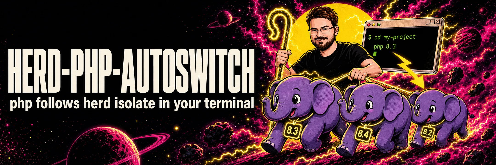

# herd-php-autoswitch

[](https://github.com/HelgeSverre/herd-php-autoswitch/actions/workflows/tests.yml)


[](https://herd.laravel.com)
[](LICENSE)

`herd isolate 8.3` pins a PHP version for a site, but only for the web server. In the terminal, `php` is still Herd's
global default. This hook switches `php` (and with it `composer`, `php artisan` and `vendor/bin` tools) to the isolated
version when you `cd` into the site, and back when you leave.

```bash
$ cd ~/Herd/my-project        # herd isolate 8.3
$ php -r 'echo PHP_VERSION;'
8.3.33
$ cd ~
$ php -r 'echo PHP_VERSION;'
8.4.25
```

Herd's own `herd php` and `herd composer` do this too, but only from the site's root directory and only with the
`herd` prefix. This hook also works in subdirectories, with plain `php` and `composer`.

## Install

Requires [Laravel Herd](https://herd.laravel.com) on macOS or Windows, and a site isolated with
`herd isolate <version>`. Open a new terminal after installing.

### zsh (macOS)

| Plugin manager | Install                                                                                                                                                                                   |
| -------------- | ----------------------------------------------------------------------------------------------------------------------------------------------------------------------------------------- |
| oh-my-zsh      | `git clone https://github.com/HelgeSverre/herd-php-autoswitch ${ZSH_CUSTOM:-~/.oh-my-zsh/custom}/plugins/herd-php-autoswitch`, then add `herd-php-autoswitch` to `plugins=(...)` in `~/.zshrc` |
| antidote       | add `HelgeSverre/herd-php-autoswitch` to `~/.zsh_plugins.txt`                                                                                                                             |
| zinit          | `zinit light HelgeSverre/herd-php-autoswitch`                                                                                                                                             |
| zap            | `plug "HelgeSverre/herd-php-autoswitch"`                                                                                                                                                  |
| sheldon        | `sheldon add herd-php-autoswitch --github HelgeSverre/herd-php-autoswitch`                                                                                                                |
| none           | see below                                                                                                                                                                                 |

Without a plugin manager:

```bash
git clone https://github.com/HelgeSverre/herd-php-autoswitch ~/.herd-php-autoswitch
echo 'source ~/.herd-php-autoswitch/herd-php-autoswitch.plugin.zsh' >> ~/.zshrc
```

Where it loads in `~/.zshrc` doesn't matter: it applies again at the first prompt, after Herd's own `PATH` line has run.

### bash (macOS)

```bash
git clone https://github.com/HelgeSverre/herd-php-autoswitch ~/.herd-php-autoswitch
echo 'source ~/.herd-php-autoswitch/herd-php-autoswitch.bash' >> ~/.bashrc
```

Terminal.app starts bash as a login shell, which reads `~/.bash_profile`; make sure it sources `~/.bashrc`.

bash has no hook for directory changes, so the switch happens when the next prompt is drawn. In a one-liner like
`cd ~/Herd/other-project && php -v`, `php` is still the previous directory's version.

### fish (macOS)

With [Fisher](https://github.com/jorgebucaran/fisher):

```fish
fisher install HelgeSverre/herd-php-autoswitch
```

Without Fisher, copy `conf.d/herd-php-autoswitch.fish` to `~/.config/fish/conf.d/`.

### PowerShell (Windows)

```powershell
git clone https://github.com/HelgeSverre/herd-php-autoswitch "$HOME\herd-php-autoswitch"
if (-not (Test-Path $PROFILE.CurrentUserAllHosts)) { New-Item -ItemType File -Path $PROFILE.CurrentUserAllHosts -Force }
Add-Content $PROFILE.CurrentUserAllHosts 'Import-Module "$HOME\herd-php-autoswitch\HerdPhpAutoswitch"'
```

Windows PowerShell 5.1 blocks profile scripts by default. Allow them once with
`Set-ExecutionPolicy -Scope CurrentUser RemoteSigned`. PowerShell 7 and 5.1 each have their own profile.

After running `herd isolate` inside a site, run `Update-HerdPhpAutoswitch` (or `cd .`) to pick up the change.

### Nushell (macOS and Windows)

```nu
git clone https://github.com/HelgeSverre/herd-php-autoswitch ~/.herd-php-autoswitch
```

Then add this line to your config (`config nu` opens it):

```nu
source ~/.herd-php-autoswitch/herd-php-autoswitch.nu
```

Like bash, Nushell runs the hook when the next prompt is drawn, so a `cd` and a `php` on the same line use the
previous directory's version.

## Verify

```bash
cd ~/Herd/my-project
php -v                          # the isolated version
composer --version 2>&1 | grep 'PHP version'
which php                       # ~/.cache/herd-php-autoswitch/83/php
```

On Windows, `(Get-Command php).Source` shows `...\.config\herd\bin\php83\php.exe`.

## How it works

Herd records isolation on the first line of the site's nginx config, for example
`~/Library/Application Support/Herd/config/valet/Nginx/my-project.test`:

```
# ISOLATED_PHP_VERSION=8.3
```

Herd's own `herd php` and `herd which-php` read the same line. On every directory change, the hook walks up from the
current directory to the nearest folder with a matching nginx config (`<folder name>.<tld>`, where the TLD comes from
Herd's `config.json`), reads that line, and puts the version first on `PATH`:

- macOS: `~/.cache/herd-php-autoswitch/83`, a folder with one symlink, `php`, pointing to Herd's `php83`.
- Windows: Herd's own `bin\php83` folder.

`composer`, `php artisan` and `vendor/bin` scripts run on whichever `php` is first on `PATH`, so they follow. The hook
reads one file per directory change (under 2 ms) and never calls the `herd` binary.

## Compatibility

- Tested with Laravel Herd 1.30 on macOS; zsh 5.9, bash 3.2 and 5.3, fish 4.9, PowerShell 7.6 and Nushell 0.115.
- Works alongside [direnv](https://direnv.net) and [mise](https://mise.jdx.dev) in zsh, bash and fish, in either load
  order (tested with direnv 2.37 and mise 2026.9).
- CI runs every shell against a fake Herd install on macOS, Ubuntu and Windows, including Windows PowerShell 5.1.
- Herd for Windows: file locations come from Herd's Windows documentation; the tests use a replica of that layout.

## Limitations

- The site is found by folder name. A site linked under a different name (`herd link other-name`) is not detected.
- A subfolder with the same name as another secured or isolated site (for example `docs` when `docs.test` exists)
  matches that site.
- After `herd isolate` or `herd unisolate` inside the site, refresh with `cd .` (zsh, fish, PowerShell, Nushell),
  `unset _herd_autoswitch_pwd` (bash), or `Update-HerdPhpAutoswitch` (PowerShell).
- A PHP version set in `.valetrc` or `.valetphprc` is not read, only `herd isolate`.
- It only changes your shell. To make Composer resolve dependencies for your production PHP version on every machine,
  also set `composer config platform.php 8.3.30`.

## Uninstall

- zsh, bash, Nushell: remove the `source` line (or the plugin entry) and the cloned folder.
- fish: `fisher remove HelgeSverre/herd-php-autoswitch`.
- PowerShell: remove the `Import-Module` line from your profile and delete the cloned folder.
- macOS: `rm -rf ~/.cache/herd-php-autoswitch`.

## Development

The tests build a fake Herd install in a temporary folder, so they run without Herd:

```bash
sh tests/run.sh              # zsh, bash, fish (whichever are installed)
pwsh -NoProfile -File tests/run.ps1
nu -n tests/run.nu
sh tests/nu-repl.sh          # Nushell REPL, needs expect
```

## License

MIT. See [LICENSE](LICENSE).
