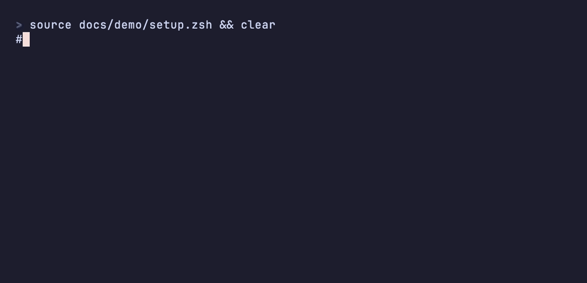

# Herd PHP Autoswitch

[](https://github.com/HelgeSverre/herd-php-autoswitch/actions/workflows/tests.yml)


[](LICENSE)

**Your terminal now uses the PHP version you set with `herd isolate`.** When you `cd` into an isolated site, `php`,
`composer` and `artisan` switch to that version, in subfolders too. When you leave, they switch back to Herd's default.
Works in zsh, bash, fish, PowerShell and Nushell, on macOS and Windows.



Herd's own `herd php` and `herd composer` only do this from the site's root folder, and only with the `herd` prefix.

## Install

You need [Laravel Herd](https://herd.laravel.com) on macOS or Windows, and a site isolated with
`herd isolate <version>`. Open a new terminal when you're done.

### zsh (macOS)

Pick your plugin manager:

- [antidote](https://antidote.sh): add `HelgeSverre/herd-php-autoswitch` to `~/.zsh_plugins.txt`
- [zinit](https://github.com/zdharma-continuum/zinit): `zinit light HelgeSverre/herd-php-autoswitch`
- [zap](https://www.zapzsh.com): `plug "HelgeSverre/herd-php-autoswitch"`
- [sheldon](https://sheldon.cli.rs): `sheldon add herd-php-autoswitch --github HelgeSverre/herd-php-autoswitch`
- [oh-my-zsh](https://ohmyz.sh): clone the repo into your custom plugins, then add `herd-php-autoswitch` to
  `plugins=(...)` in `~/.zshrc`:

  ```bash
  git clone https://github.com/HelgeSverre/herd-php-autoswitch ${ZSH_CUSTOM:-~/.oh-my-zsh/custom}/plugins/herd-php-autoswitch
  ```

No plugin manager? Clone the repo and source the plugin:

```bash
git clone https://github.com/HelgeSverre/herd-php-autoswitch ~/.herd-php-autoswitch
echo 'source ~/.herd-php-autoswitch/herd-php-autoswitch.plugin.zsh' >> ~/.zshrc
```

It can go anywhere in `~/.zshrc`.

### bash (macOS)

Works with bash 3.2 (the one macOS ships) and newer.

```bash
git clone https://github.com/HelgeSverre/herd-php-autoswitch ~/.herd-php-autoswitch
echo 'source ~/.herd-php-autoswitch/herd-php-autoswitch.bash' >> ~/.bashrc
```

- Terminal.app reads `~/.bash_profile`, not `~/.bashrc`. Make sure your `~/.bash_profile` sources `~/.bashrc`.
- bash switches when the next prompt appears, not during `cd`. So in `cd other-project && php -v`, `php` is still the
  old version. Run the two commands on separate lines.

### fish (macOS)

Works with fish 3.5 and newer. With [Fisher](https://github.com/jorgebucaran/fisher):

```fish
fisher install HelgeSverre/herd-php-autoswitch
```

Without Fisher, copy `conf.d/herd-php-autoswitch.fish` into `~/.config/fish/conf.d/`.

### PowerShell (Windows)

Works with PowerShell 7 and Windows PowerShell 5.1. Clone the repo and load the module from your profile:

```powershell
git clone https://github.com/HelgeSverre/herd-php-autoswitch "$HOME\herd-php-autoswitch"
if (-not (Test-Path $PROFILE.CurrentUserAllHosts)) { New-Item -ItemType File -Path $PROFILE.CurrentUserAllHosts -Force }
Add-Content $PROFILE.CurrentUserAllHosts 'Import-Module "$HOME\herd-php-autoswitch\HerdPhpAutoswitch"'
```

- PowerShell 7 and 5.1 use separate profiles. Run the last two lines in each one you use.
- 5.1 blocks profile scripts by default. Allow them once with `Set-ExecutionPolicy -Scope CurrentUser RemoteSigned`.
- 5.1 switches when the next prompt appears, like bash. PowerShell 7 switches right away.

### Nushell (macOS and Windows)

Clone the repo:

```nu
git clone https://github.com/HelgeSverre/herd-php-autoswitch ~/.herd-php-autoswitch
```

Then add this line to your config (run `config nu` to open it):

```nu
source ~/.herd-php-autoswitch/herd-php-autoswitch.nu
```

[Nushell](https://www.nushell.sh) switches when the next prompt appears, like bash.

## Check that it works

```bash
cd ~/Herd/my-project
php -v                                          # your isolated version
composer --version 2>&1 | grep 'PHP version'    # the same version
which php                                       # ~/.cache/herd-php-autoswitch/83/php
```

On Windows, `(Get-Command php).Source` should end in `\.config\herd\bin\php83\php.exe`.

## How it works

When you run `herd isolate 8.3`, Herd writes this line at the top of the site's nginx config, for example
`~/Library/Application Support/Herd/config/valet/Nginx/my-project.test`:

```
# ISOLATED_PHP_VERSION=8.3
```

Herd reads the same line for `herd php`. Each time you change folders, the hook:

1. finds the Herd site you're in, the same way Herd does: a folder linked with `herd link` (named after the link), or a
   folder directly inside a parked path (`herd park`). It checks the current folder first, then each parent folder.
2. reads the PHP version from that site's config line,
3. puts that version's folder first on your `PATH`:
   - on macOS, `~/.cache/herd-php-autoswitch/83`, which holds a `php` link to Herd's `php83`
   - on Windows, Herd's own `bin\php83` folder

`composer`, `php artisan` and tools in `vendor/bin` all use the first `php` on your `PATH`, so they follow along. Each
switch takes 1 to 2 ms.

If a site is isolated to a PHP version that isn't installed in Herd, you get a one-line warning when you enter it, and
the default PHP stays in place.

## Compatibility

- Tested with Laravel Herd 1.30 on macOS, with zsh 5.9, bash 3.2 and 5.3, fish 4.9, PowerShell 7.6 and Nushell 0.115.
- Works alongside [direnv](https://direnv.net) and [mise](https://mise.jdx.dev) in zsh, bash and fish (tested with
  direnv 2.37 and mise 2026.9).
- CI tests every shell on macOS, Ubuntu and Windows, including Windows PowerShell 5.1. It uses a fake Herd install,
  copied from Herd's documented folder layout.

## Limitations

- It changes the shell you're typing in. Scripts, child shells and IDE tasks keep the PHP version that was active when
  they started, even if they `cd` into another project.
- Aliases win over `PATH`. If you have `alias php='herd php'` or `alias composer='herd composer'`, remove them.
- Only `herd isolate` is read. PHP versions in `.valetrc` or `.valetphprc` files are ignored.
- It only changes your own terminal. To make Composer pick packages for your production PHP version on every machine,
  also run `composer config platform.php 8.3.30` in the project.

If you run `herd isolate` or `herd unisolate` inside a site, refresh with:

- zsh, fish, Nushell: `cd .`
- bash: `unset _herd_autoswitch_pwd`
- PowerShell: `Update-HerdPhpAutoswitch`

## Uninstall

- zsh, bash, Nushell: remove the `source` line (or the plugin entry) and delete the cloned folder.
- fish: `fisher remove HelgeSverre/herd-php-autoswitch`
- PowerShell: remove the `Import-Module` line from your profile and delete the cloned folder.
- On macOS, also run `rm -rf ~/.cache/herd-php-autoswitch`.

## Development

The tests use a fake Herd install in a temporary folder, so you don't need Herd to run them:

```bash
sh tests/run.sh                        # zsh, bash, fish (whichever are installed)
pwsh -NoProfile -File tests/run.ps1    # PowerShell module
nu -n tests/run.nu                     # Nushell
sh tests/nu-repl.sh                    # Nushell REPL (needs expect)
```

To re-record the demo GIF (needs [VHS](https://github.com/charmbracelet/vhs) and Herd with PHP 8.3 and 8.4). It creates a
temporary Herd site; the second command removes it:

```bash
vhs docs/demo/demo.tape
sh docs/demo/cleanup.sh
```

## License

MIT. See [LICENSE](LICENSE).
